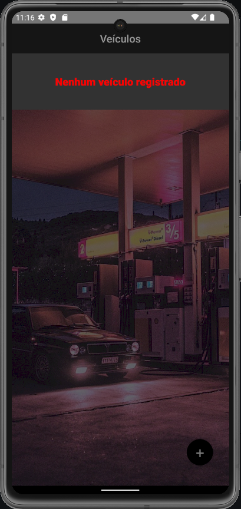
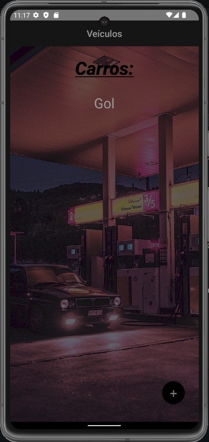
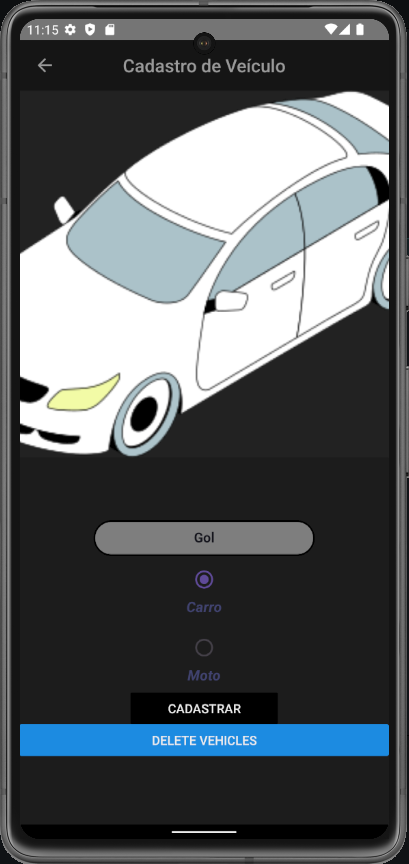
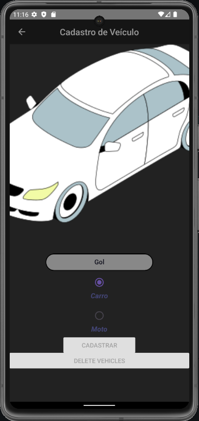
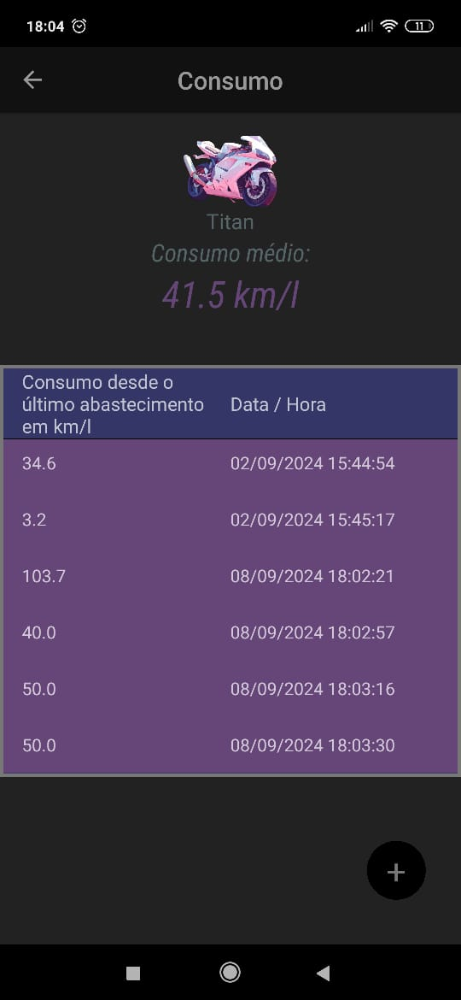
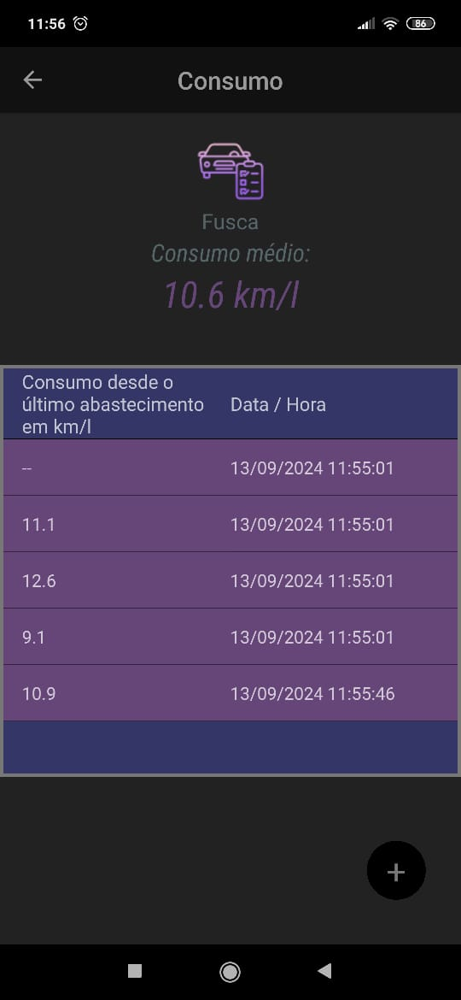

# This is a mobile app to calculate the consumptiom average of the vehicles.

## Initial Screen showing all registered vehicles

   
   
   
   

## Register some vehicles

   
   
   

## Screens of the consumption average and the supplies of the vehicles.

      
   
   
   
   
   

